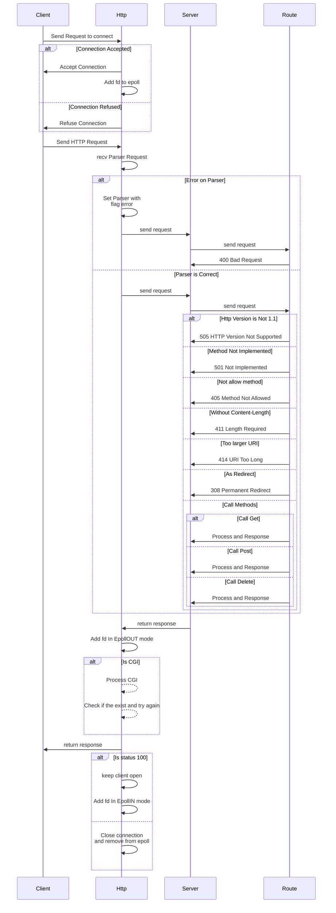
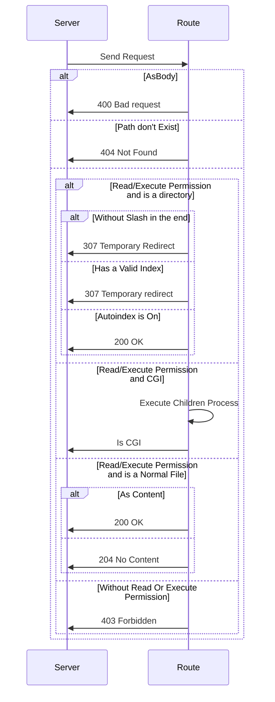
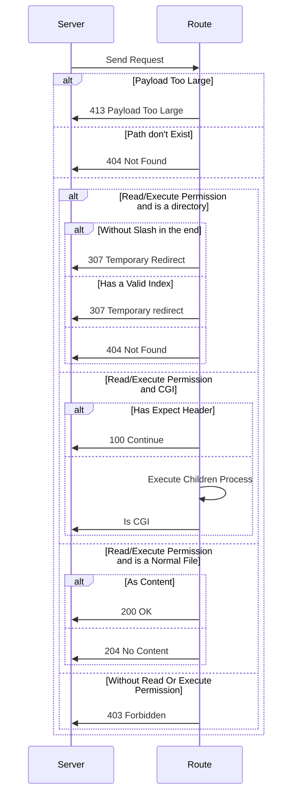
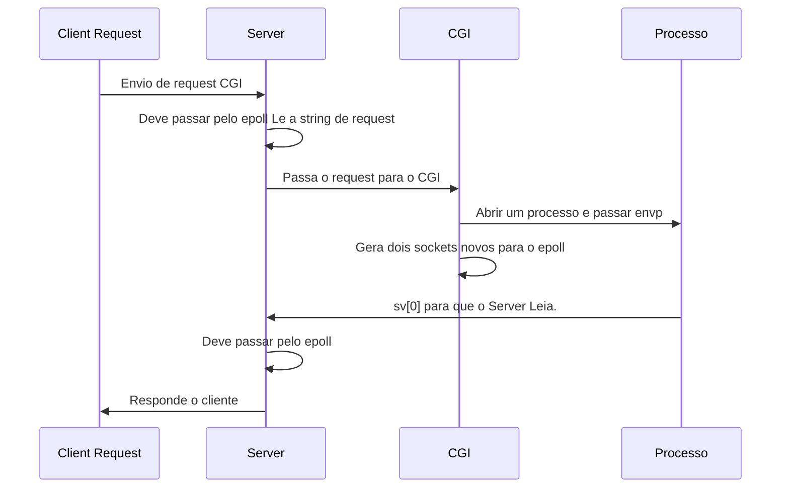

# web-server


# TODO

- [x] Check [0, -1] for recv and send
- [x] Ignore signals before Parser
- [] Definir para que quando o server não for encontrado seja o primeiro server configurado.
- [] Definir para que quando o route não for encontrado seja o primeiro route configurado.
- [] Ajustar Variaveis a parametros CGI
- [] Check Possible status code
- [] Check DELETE Status Code Flow
- [] Check POST Status Code Flow
- [] Check GET Status Code Flow
- [] Add path download to the parser
- [] Check UNKNOWN Method
- [] Upload a File in the server and get back
- [] Set CGI in the correct path
- [] Test A CGI with a infinite loop
- [] Test a CGI with crash script
- [] Adjust the hostname part
- [] Add timeout function in the correct form.
- [] Check Problem in image render
- [] Add CGI Write in epoll
- [] Check Leaks


# Request Before Method



# GET


````mermaid
sequenceDiagram
    Server->>Route: Send Request
    alt Payload Too Large
        Route->>Server: 413 Payload Too Large
    else Path don't Exist
        Route->>Server: 404 Not Found
    else Write/Execute Permission and is A Directory
        Route->Route: Delete Directory
        Route->>Server: 200 OK
    else Write/Excute Permission
        Route->Route: Delete File
        Route->>Server: 200 OK
    else Without Write/Excute Permission
        Route->>Server: 403 Forbidden
    end
```

# Post


408 Request Timeout
502 Bad Gateway: O servidor atuando como um gateway ou proxy recebeu uma resposta inválida do servidor upstream.


## Arquivo de configuração

### Server Name
`server_name:` Será o nome DNS dado para o ip.
- pode receber um ou mais nomes que terão como destino esse server.
- Se não por informando um server name padrão é atribuido.

```
server {
    server_name domain.com www.domain.com
}
```

### Listen
`listen:` Listen recebe dois parametros, IP:PORT, um ip default assume se o IP não for especificado.

```
server {
    listen 192.168.1.100:8081
}

server {
    listen 8082; # Sem especificar IP.
}
```

### Error page

`error_page:` define uma paǵina de erro padrão para o server ou para a location.
- Pode receber um ou mais códigos de erros que fazer referência a um arquivo a ser retornado.

```
server {
    error_page 404 /404.html;
    error_page 500 502 503 504 /50x.html;

    location /home {
        error_page 404 /home/errors/home-404.html;
    }
}
```
- Caso o acesso seja realizado em `/` o 404.html será retornado.
- Caso o acesso seja realizado em `/home` o home-404.html será retornado.

### Client Max Body Size

`client_max_body_size:` Define o tamanho maximo do body de request do client e recebe como paramento o valor e uma letra com a unidade de medida.
- `K` para Kilo bytes.
- `M` para Mega bytes.
- `G` para Giga bytes.

```
server {
        location /app/crash-limit-m {
            client_max_body_size 2M;
        }

        location /app/crash-limit-g {
            client_max_body_size 1G;
            
        }

        location /app/crash-limit-k {
            client_max_body_size 2K;
        }
}
```

### Allow Methods
`allow_methods:` descreve os metodos permitidos.
- recebe uma lista com os metodos.

```
server {
    allow_methods GET;

    location /images {
        allow_methods GET POST DELETE;
    }
}
```

### Redirect
`rewrite:` redireciona para outro location.
- pode ser definido em server, nesse caso os paramentros são <caminho atual, caminho desejado>
- pode ser definido em location, nesse caso o parametro é o caminho desejado.

```
server {

    rewrite /jogo /games;

    location /img {
        rewrite /images;
    }

    location /jogo {

    }

    location /games {

    }
}
```

### Define a Root
`root:` define o diretorio que será o root da aplicação.
- recebe como parametro o caminho partindo da raiz do sistema.
- pode ser definido no server e em location.

```
server {
    root /app/

    location /images {
        /images
    }
}
```

### Directory Listing
`autoindex:` Permite a exibição dos arquivos de um diretorio caso nenhum arquivo de index seja encontrato.
- recebe como paramentro `on` ou `off`.
- por padrão vem como `off`.
- pode ser definido no server ou em location especificas.

```
server {
    autoindex on;

    location /home {
        autoindex off;
    }

    location / {

    }
}
```


### Default file for response
`index:` Define uma lista de arquivos que podem ser devolvidos caso o caminho seja uma pasta.
- recebe como paramentro uma lista de nomes.

```
server {
    index index.html index.htm default.html;
}
```

### 


`strerror:`

`gai_strerror:`

`socketpair:`

### htons, htonl, ntohs e ntohl
Usados para converter a ordem dos bytes. (pg 17 Beej's Guide to Network Programming)

`htons:` host to network short (uint32_t)

`htonl:` host to network long (uint16_t)

`ntohs:` network to host short (uint32_t)

`ntohl:` network to host long (uint16_t)

Básicamente usado para converter a ordem dos bytes de forma que a estrutura do seu processador possa compreender.

`select, poll and epoll:`

`epoll_create:`

`epoll_ctl:`

`epoll_wait:`

`kqueue:`

`kevent:`


## Ordem de chamadas:
> A seções a seguir definem uma ordem de chamdas para um conexão.

### Pesquisar no DNS por nome de host - (www.example.com)

`getaddrinfo:` Traduz um nome de host (www.google.com) para um ip. Responde com uma struct addrinfo.

```c++
int getaddrinfo(const char *node, // Ex. "www.example.com" ou IP
    const char *service, // Ex. "http" ou número da porta
    const struct addrinfo *hints, // estrutura com informações esperadas do resultado.
    struct addrinfo **res // ponteiro para armazena o resultados da função.
);
```

`freeaddrinfo:` Limpa a estrutra de resposta.

### Socket

```c++
  struct addrinfo {
    int             ai_flags; // AI_PASSIVE, AI_CANONNAME, etc.
    int             ai_family; // AF_INET, AF_INET6, AF_UNSPEC
    int             ai_socktype; // SOCK_STREAM, SOCK_DGRAM
    int             ai_protocol; // use 0 para "qualquer"
    size_t          ai_addrlen; // tamanho de ai_addr em bytes
    struct sockaddr *ai_addr; // struct sockaddr_in ou _in6
    char            *ai_canonname; // nome de host canônico e completo
    struct addrinfo *ai_next; // Príximo addrinfo da lista
};  
```
`AF_INET:` Força o uso de ipv4.
`AF_INET6:` Força o uso de ipv6.
`AF_UNSPEC:` Tanto ipv4 quanto ipv6.
`SOCK_STREAM:` Implementa o protocolo TCP ( Transmission Control Protocol).
`SOCK_DGRAM:` Implementa o protocolo UDP (User Datagram protocol).

```c++
struct sockaddr {
    unsigned short  sa_family; // familia de endereços. (ipv4 | ipv6)
    char            sa_data[14]; // 14 bytes de endereço do protocolo.
};

struct sockaddr_in {
    short int           sin_family; // Família de endereços, AF_INET
    unsigned short int  sin_port; // Número de Porta
    struct in_addr      sin_addr; // Endereço Internet
    unsigned char       sin_zero[8]; // Mesmo tamanho que struct sockaddr
};
```

`socket:` retorna um arquivo socket. `Similar ao open` e tem a mesma função de abrir um arquivo de I/O.

Exemplo de chamada:
```c++
struct protoent ent;
ent = getprotobyname("TCP");
int fd = socket(PF_INET, SOCK_STREAM, ent.p_proto)
```
Essa familia define a ai-family como PF_INET, o tipo do protocolo e TCP e passa o numero do protocolo TCP.

### Bind - Relaciona uma porta ao socket.

`bind:` Tem a função de relacionar uma struct sockaddr com uma porta do sistema.

```c++
    struct addrinfo hints, *res;
    int sockfd;
    memset(&hints, 0, sizeof(hints));
    hints.ai_family = AF_UNSPEC; // tanto faz ser IPv4 ou IPv6
    hints.ai_socktype = SOCK_STREAM; // use TCP
    hints.ai_flags = AI_CANONNAME; // retorna o nome do host. 

    getaddrinfo("192.168.0.200", "8080", &hints, &res);

    sockfd = socket(res->ai_family, res->ai_socktype, res->ai_protocol);
    bind(sockfd, res->ai_addr, res->ai_addrlen);
```

Nesse caso teremos um vinculo do socket criando com a porta 8080 do ip 192.168.0.200.

### Connect - Usado para realizar a conecxão com um socket.

`connect:` Estabelece uma vinculo de conecxao com o socket especificado.

### Listen - Aguarda o envio de mesagens.

`listen:`

### Accept

`accept:`

`send:`

`recv:`

`chdir bind:`

`setsockopt:`

`getsockname:`

### Pegar informações do protocolo

`getprotobyname:` retonar uma struct protoent que ccontém informações do protocolo da chamada. (pg 31 Beej's Guide to Network Programming)

```C++
getprotobyname("TCP"); // traz informações do protocolo TCP.
getprotobyname("UDP"); // traz informações do protocolo UDP.

struct protoent {
    char    *p_name; // nome oficial do protocolo.
    char    **p_aliases; // lista com alias do protocolo.
    int     P_proto; // Numero do protocolo.
}

```

`access:`

`fcntl:`

`stat:`

`opendir:`

`readdir:`

`closedir:`

# References

- [Google C++ Style Guide](https://google.github.io/styleguide/cppguide.html)
- [GoogleTest](https://google.github.io/googletest/)
- [Beej's Guide to Network Programming](https://beej.us/guide/bgnet/)
- [Internet Protocol](https://datatracker.ietf.org/doc/html/rfc791)
- [ Transmission Control Protocol](https://datatracker.ietf.org/doc/html/rfc793)
- [User Datagram protocol](https://datatracker.ietf.org/doc/html/rfc768)
- [Guide to network concepts](https://beej.us/guide/bgnet0/html/split/)
- [Address Allocation for Private Internets](https://datatracker.ietf.org/doc/html/rfc1918)
- [CGI RFC 3875](https://datatracker.ietf.org/doc/html/rfc3875)
- [Unique Local IPv6 Unicast Addresses](https://datatracker.ietf.org/doc/html/rfc4193)
- [Protocolo HTTP](https://developer.mozilla.org/en-US/docs/Web/HTTP/Basics_of_HTTP/Identifying_resources_on_the_Web)
- [Overview of webserver](https://excalidraw.com/#room=fc1367eea05a706ab29e,qKnHZ8dxThptsr0YgXLOvw)
- [I/O Multiplexing](https://www.softprayog.in/programming/io-multiplexing-select-poll-epoll-in-linux)

### Headers Refs
- [Mozzila Headers Ref](https://developer.mozilla.org/pt-BR/docs/Web/HTTP/Headers)

### Status Code Refs
- [RFC Status Code Ref](https://www.rfc-editor.org/rfc/rfc9110)
- [Cat Status Code Ref](https://http.cat/)

